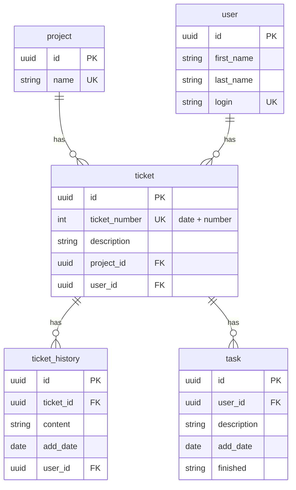

# Entities diagram

## Application entity diagram

```mermaid
erDiagram
    project {
        uuid id PK
        string name UK
    }
    user {
        uuid id PK
        string first_name
        string last_name
        string login UK
%%        string password
    }
    ticket {
        uuid id PK
        int ticket_number UK "date + number"
        string description
        uuid project_id FK
        uuid user_id FK
    }
    project ||--o{ ticket : has
    user ||--o{ ticket : has
    ticket_history {
        uuid id PK
        uuid ticket_id FK
        string content
        date add_date
        uuid user_id FK
    }
    ticket ||--o{ ticket_history : has
    task {
        uuid id PK
        uuid user_id FK
        string description
        date add_date
        string finished 
    }
    ticket ||--o{ task : has
```
